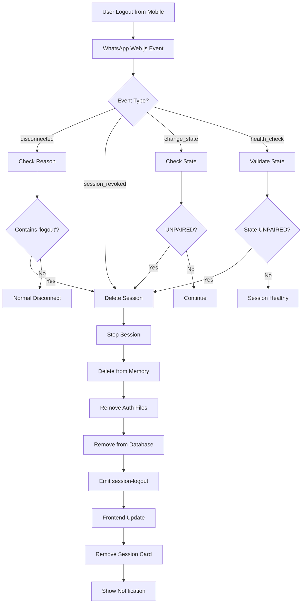

# Auto-Delete Session saat Logout dari Mobile

## 📱 Fitur Overview

Sistem WhatsApp Multi-Session sekarang dilengkapi dengan fitur **Auto-Delete Session** yang akan otomatis menghapus session dari sistem ketika WhatsApp dilogout dari aplikasi mobile.

## 🔍 Cara Kerja

### 1. **Event Detection**

Sistem mendeteksi logout melalui beberapa cara:

-   **Disconnection Events**: Mendeteksi reason `logout`, `navigation`, atau `LOGOUT`
-   **Session Revoked**: Event `session_revoked` dari WhatsApp Web.js
-   **State Changes**: Event `change_state` untuk status `UNPAIRED` atau `UNPAIRED_IDLE`
-   **Health Monitoring**: Pemeriksaan berkala setiap menit untuk mendeteksi session yang unpaired

### 2. **Automatic Cleanup**

Saat logout terdeteksi, sistem akan:

1. **Stop Session** - Menutup koneksi WhatsApp Web
2. **Remove from Memory** - Menghapus session dari Map
3. **Delete Auth Files** - Menghapus folder `.wwebjs_auth/session-{id}`
4. **Remove from Database** - Menghapus record dari MySQL
5. **Notify Frontend** - Kirim event `session-logout` via Socket.IO

### 3. **Real-time UI Updates**

Frontend akan:

-   **Remove Session Card** - Session hilang dari dashboard secara otomatis
-   **Show Notification** - Toast notification dengan icon 🚪
-   **Update Session List** - State management yang real-time

## 🎯 Skenario yang Ditangani

### ✅ **Supported Scenarios**

1. **Logout dari Mobile**:

    - User logout WhatsApp dari HP
    - Session otomatis terhapus dari sistem

2. **Logout dari Device Lain**:

    - Login WhatsApp Web di perangkat lain
    - Session lama otomatis terhapus

3. **Unpaired State**:

    - WhatsApp Web kehilangan pairing dengan mobile
    - Session otomatis terhapus

4. **Session Revoked**:
    - WhatsApp server merevoke session
    - Session otomatis terhapus dari sistem

### ⚠️ **Health Monitoring**

-   **Interval**: Setiap 60 detik
-   **Check**: Status `UNPAIRED`/`UNPAIRED_IDLE`
-   **Action**: Auto-delete session yang terdeteksi unpaired

## 📋 Event Flow



## 🛠️ Technical Implementation

### Backend Changes

1. **Enhanced Event Listeners**:

    ```typescript
    client.on('disconnected', async (reason) => {
      const reasonStr = reason?.toString().toLowerCase() || '';
      if (reasonStr.includes('logout') || reason === 'LOGOUT') {
        await this.deleteSession(id);
        this.io.emit('session-logout', { sessionId: id, ... });
      }
    });

    client.on('session_revoked', async () => {
      await this.deleteSession(id);
      this.io.emit('session-logout', { sessionId: id, ... });
    });

    client.on('change_state', async (state) => {
      if (state === 'UNPAIRED' || state === 'UNPAIRED_IDLE') {
        await this.deleteSession(id);
        this.io.emit('session-logout', { sessionId: id, ... });
      }
    });
    ```

2. **Health Monitoring**:

    ```typescript
    startHealthMonitoring(): void {
      setInterval(async () => {
        for (const [sessionId, session] of this.sessions) {
          if (session.status === 'connected') {
            await this.validateSessionHealth(sessionId);
          }
        }
      }, 60000); // Every minute
    }
    ```

3. **Enhanced Delete Session**:
    ```typescript
    async deleteSession(sessionId: string): Promise<void> {
      // Stop session
      await this.stopSession(sessionId);

      // Remove from memory
      this.sessions.delete(sessionId);

      // Remove auth files
      fs.rmSync(sessionPath, { recursive: true, force: true });

      // Remove from database
      await this.database.deleteSession(sessionId);
    }
    ```

### Frontend Changes

1. **New Socket Event Handler**:

    ```typescript
    socket.on("session-logout", ({ sessionId, reason, message }) => {
        // Remove session from state
        setSessions((prev) =>
            prev.filter((session) => session.id !== sessionId)
        );

        // Show notification
        toast.error(`Session ${sessionId} removed: ${message}`, {
            duration: 5000,
            icon: "🚪",
        });
    });
    ```

2. **New Event Type**:
    ```typescript
    export interface SocketEvents {
        "session-logout": {
            sessionId: string;
            reason: string;
            message: string;
        };
    }
    ```

## 🎉 Benefits

1. **Automatic Cleanup** - Tidak perlu manual delete session
2. **Real-time Updates** - UI langsung terupdate saat logout
3. **Clean State** - Database dan filesystem tetap bersih
4. **Better UX** - User tidak melihat session yang sudah tidak aktif
5. **Resource Efficient** - Tidak ada session zombie yang memakan resource

## 🔧 Testing

Untuk menguji fitur ini:

1. **Create Session** - Buat session baru dan scan QR code
2. **Connect Mobile** - Pastikan session connected
3. **Logout from Mobile** - Logout WhatsApp dari HP
4. **Observe Dashboard** - Session akan hilang otomatis dalam 1-2 menit
5. **Check Notification** - Toast notification akan muncul

## 📝 Notes

-   Health monitoring berjalan setiap 60 detik
-   Session cleanup bersifat irreversible
-   Logout detection bekerja untuk semua jenis logout
-   Real-time notification via Socket.IO
-   Complete cleanup (memory + files + database)
